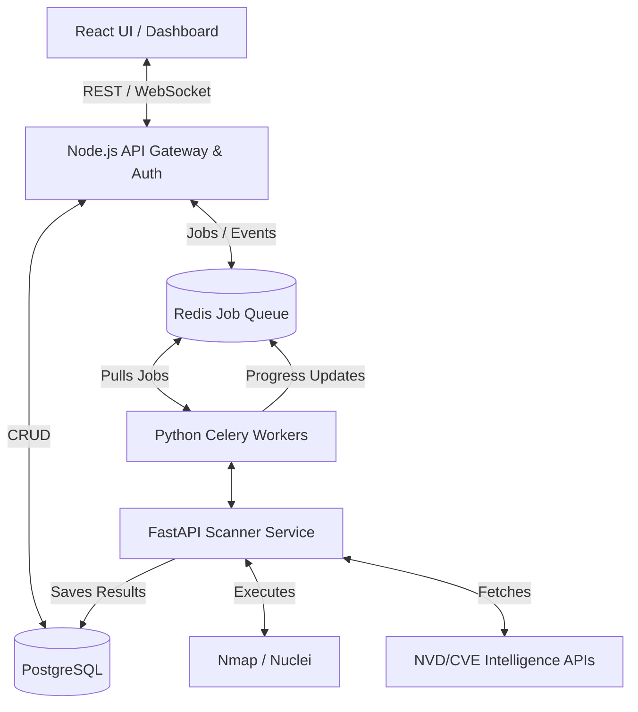

# Architecture Overview

VulnX is designed as an Enterprise Vulnerability Management Platform. It separates concerns between the main API serving the frontend (Node.js) and the scanning engine doing heavy lifting (Python).

## 1. System Architecture Diagram

## 2. Component Responsibilities

### Frontend (React + TypeScript)
- Provides a real-time dashboard for vulnerability tracking.
- Manages assets, users, organizations, and remediation workflows.
- Uses WebSockets to receive live scan progress updates.

### Main API (Node.js + Express)
- Handles user authentication, authorization, and RBAC.
- Provides CRUD operations for Assets, Organizations, and Vulnerabilities.
- Initiates scan jobs by pushing messages to Redis.
- Relays real-time updates from Redis to the frontend via WebSockets.

### Scanning Engine (Python + FastAPI/Celery)
- Asynchronous worker architecture to prevent blocking HTTP requests.
- Executes physical scans against registered target assets in isolated labs using `nmap`.
- Matches discovered software and versions (CPEs) against the NVD database.
- Calculates a contextual Risk Score based on CVSS, Asset Criticality, Internet Exposure, etc.

## 3. Data Flow Example: Triggering a Scan
1. Analyst clicks "Scan" on Asset A (e.g., `192.168.1.50`).
2. Frontend sends `POST /api/scans { assetId: "A" }` to Node.js API.
3. Node.js API validates RBAC and creates a `scan_jobs` record in PostgreSQL with status `PENDING`.
4. Node.js pushes the job onto the Redis queue and returns the `job_id` to the frontend.
5. A Python Celery worker picks up the job from Redis and begins executing `nmap`.
6. As `nmap` progresses, the worker pushes progress updates to Redis.
7. Node.js receives progress updates from Redis and pushes them over WebSockets to the frontend.
8. When `nmap` finishes, Python correlates the CPEs with CVEs from the NVD API.
9. Python writes the resulting vulnerabilities back to PostgreSQL.
10. The scan status is marked `COMPLETED`.
